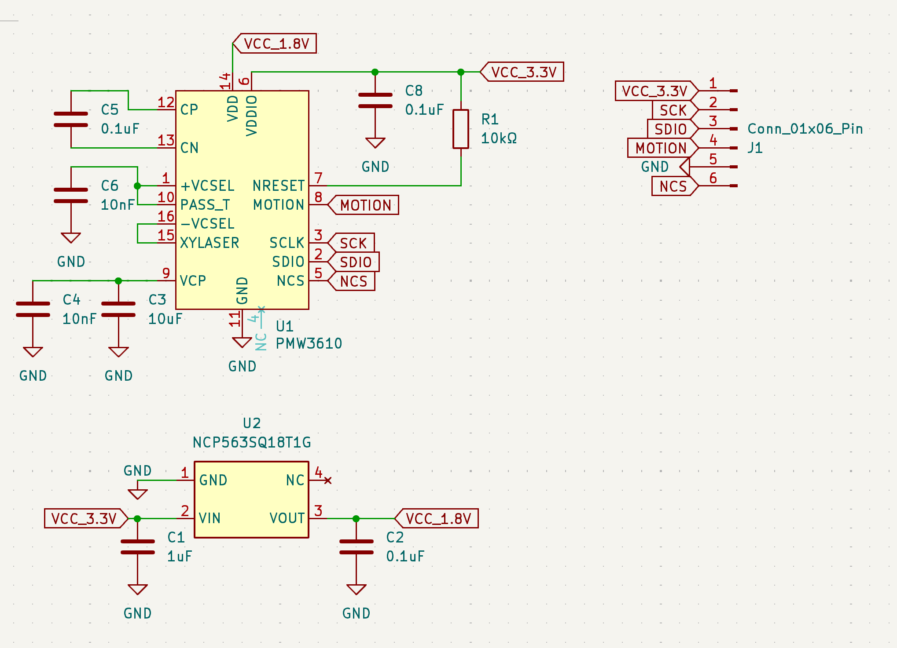
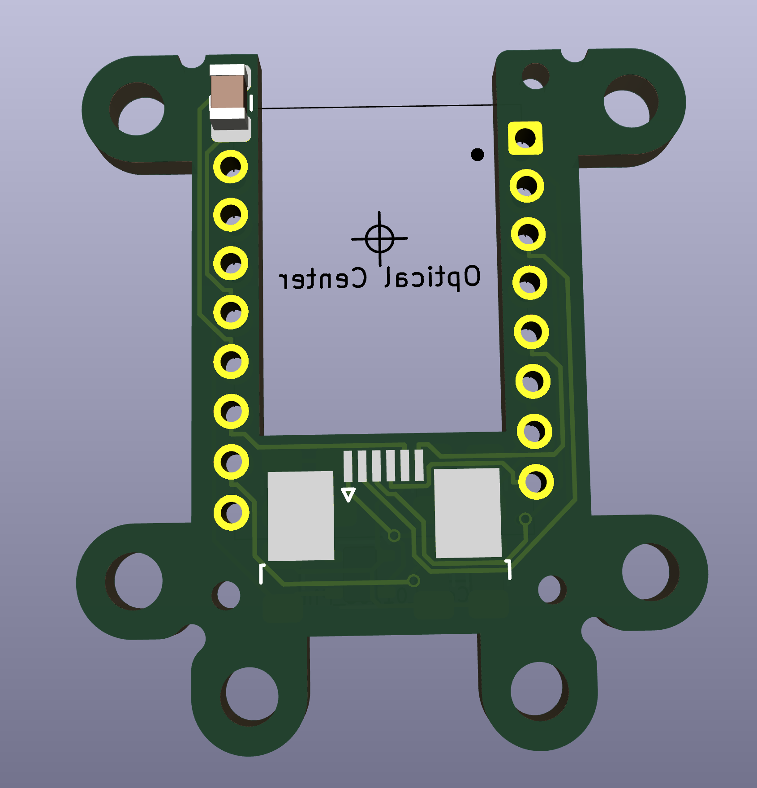
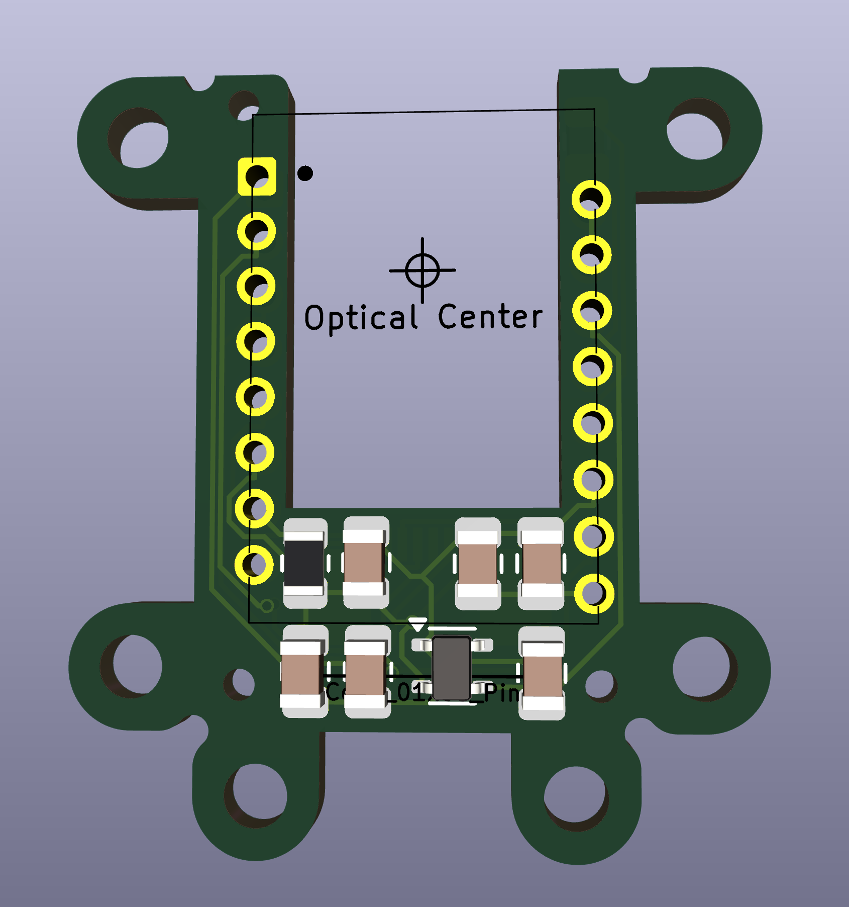
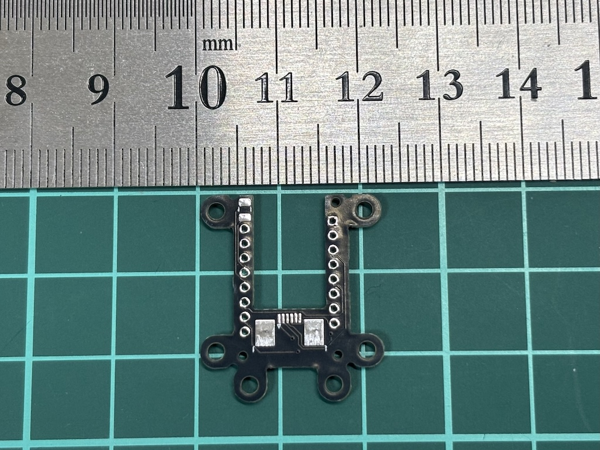
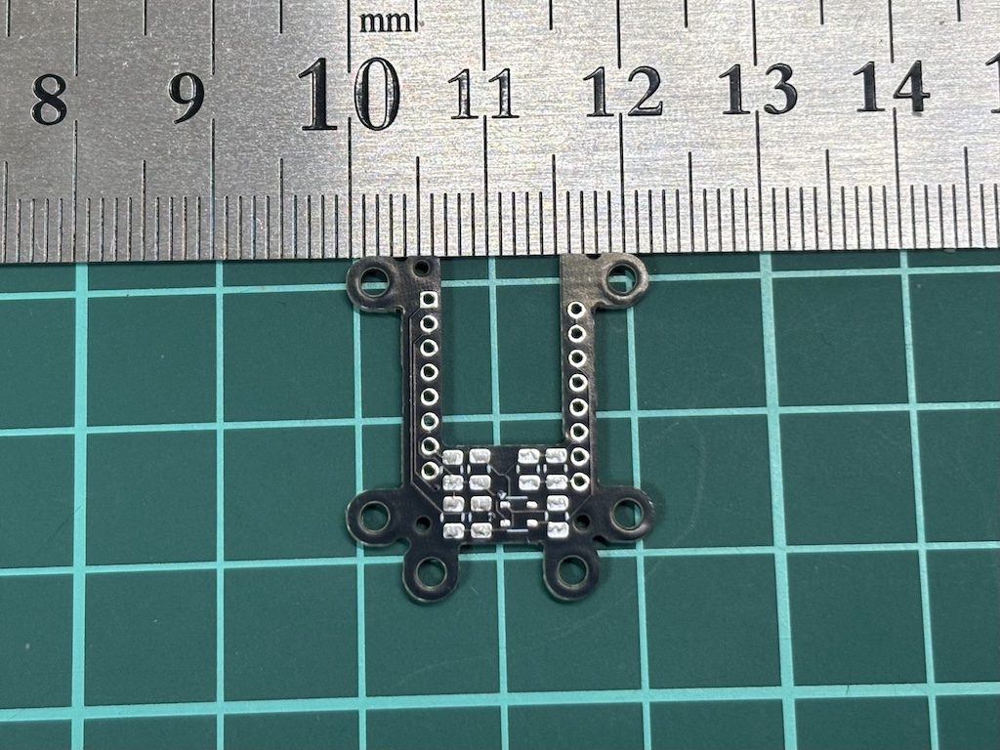

## PMW3610 breakout board (v1)

Features

- width = **14mm** (by cutting mounting holes)
- height = 21mm (by cutting mounting holes)
- 3.6V support
- 6pin 5mm pitch FFC

Problems

- Requires high manual soldering skills
- Unstable due to LDO's poor transient response?
  - It got stable by replacing C2 to 10uF in my case

