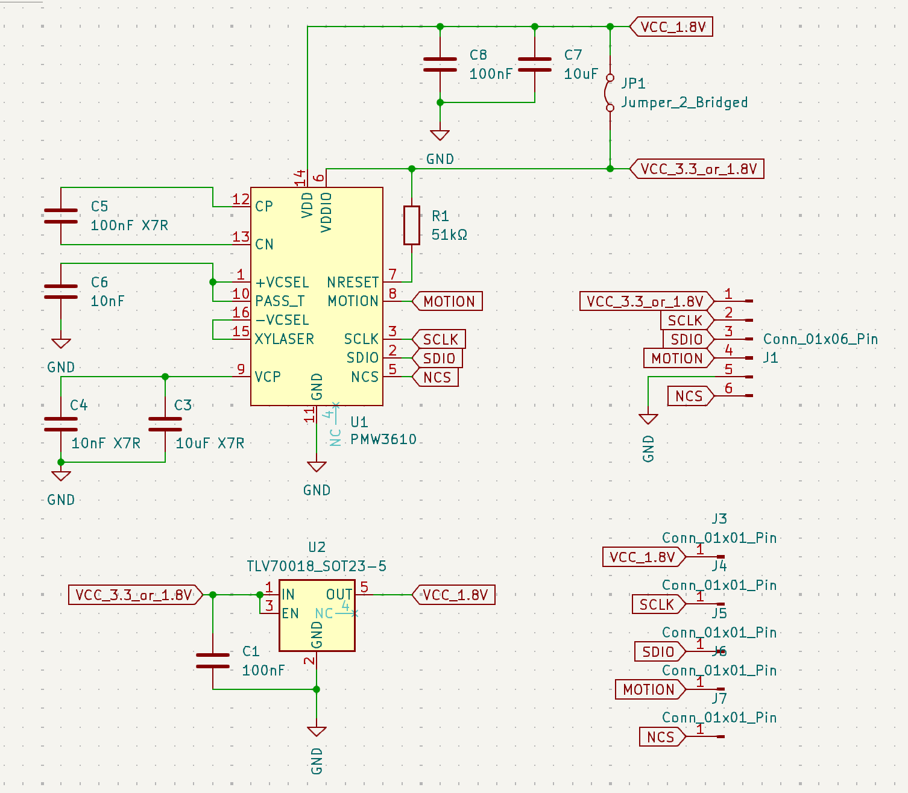
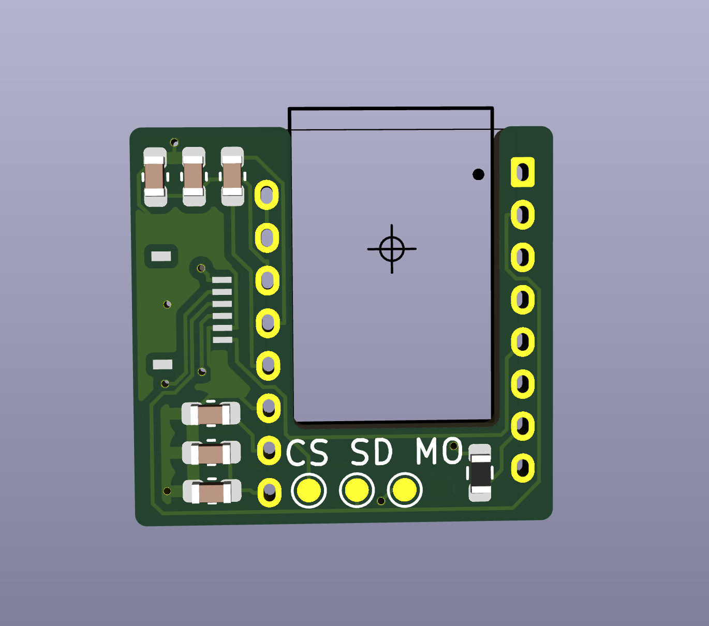
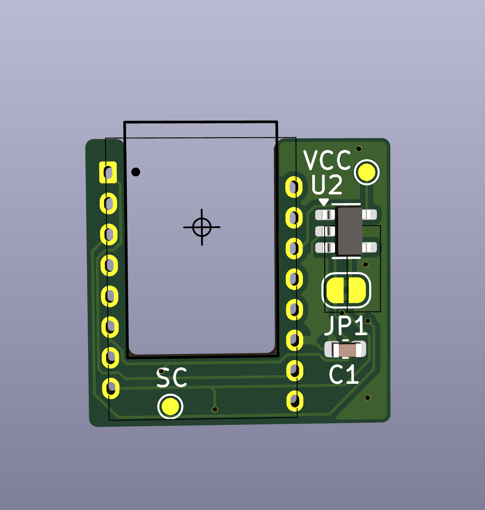
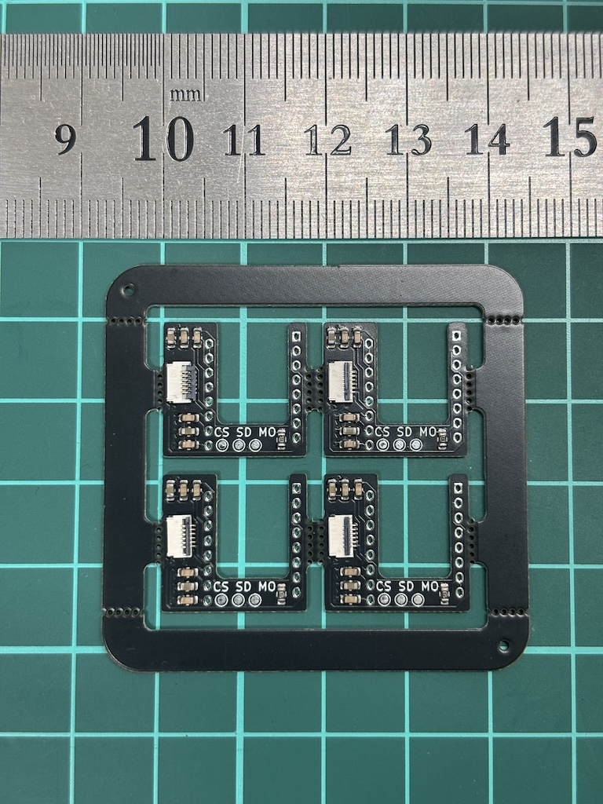
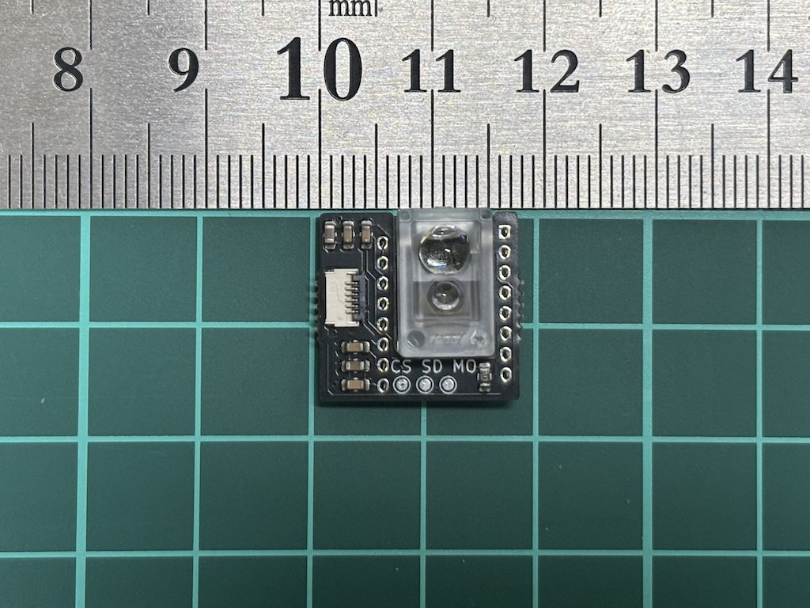
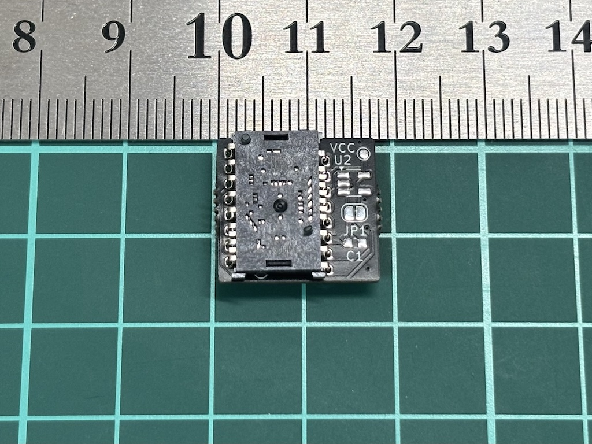
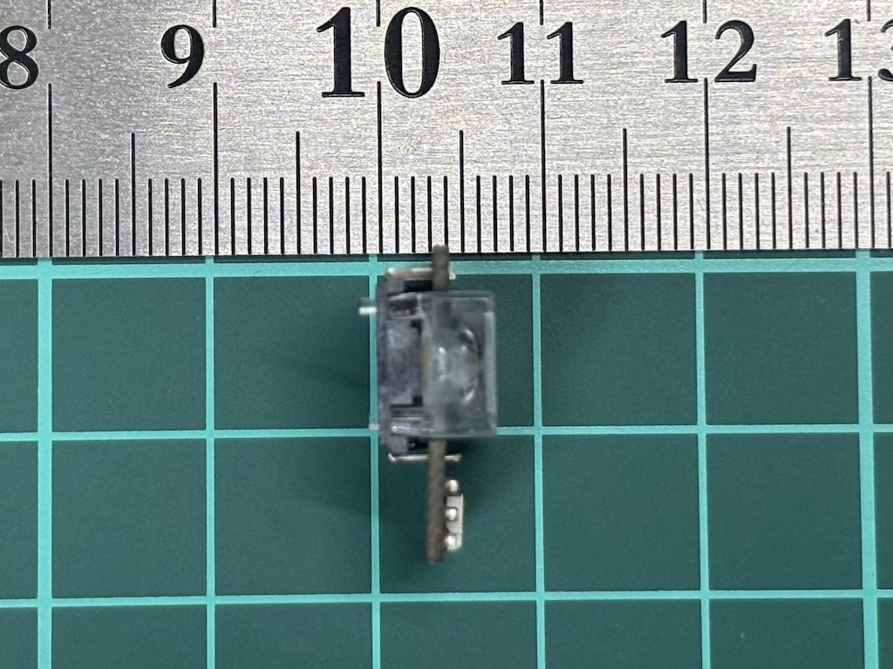

## PMW3610 breakout board (v2)

**The functionality is not confirmed yet.**

Features

- width = 17.6mm
- height = 16.6mm
- Designed for PCB assembly
- 1.8V support without additional manual SMT chip soldering
- 3.6V support by manually soldering LDO
- 6pin 5mm pitch FFC
- Test pad

### Assembled PCB

2x2 panelized board (PCB assembled by jlcpcb)

