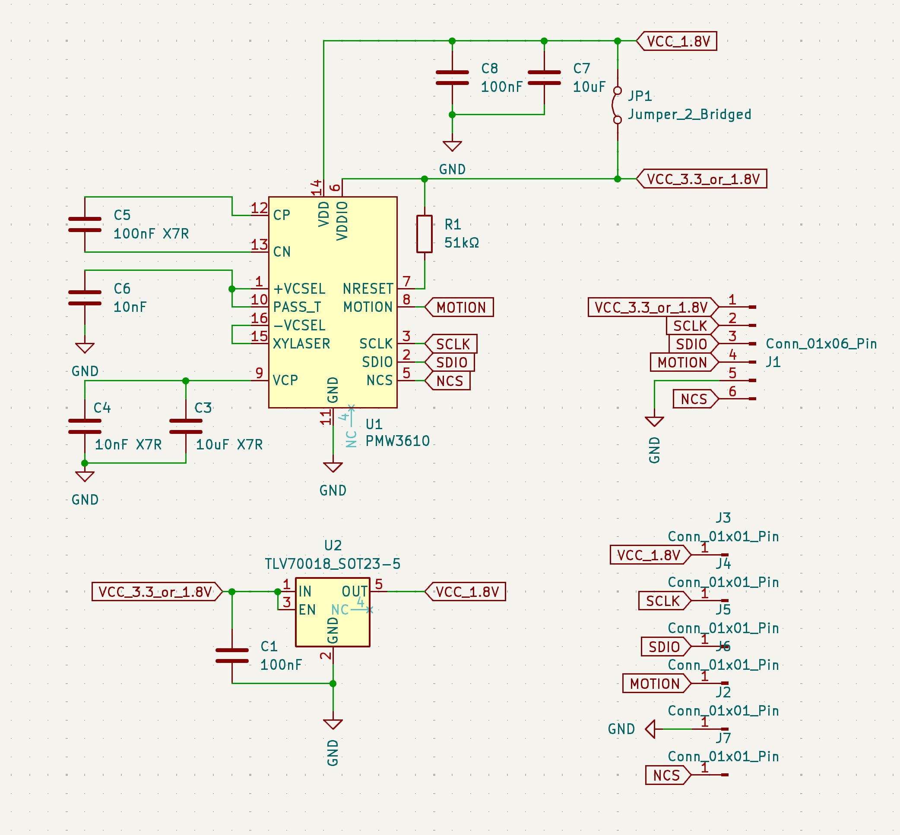
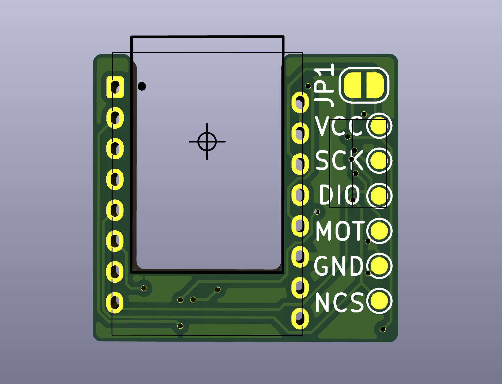
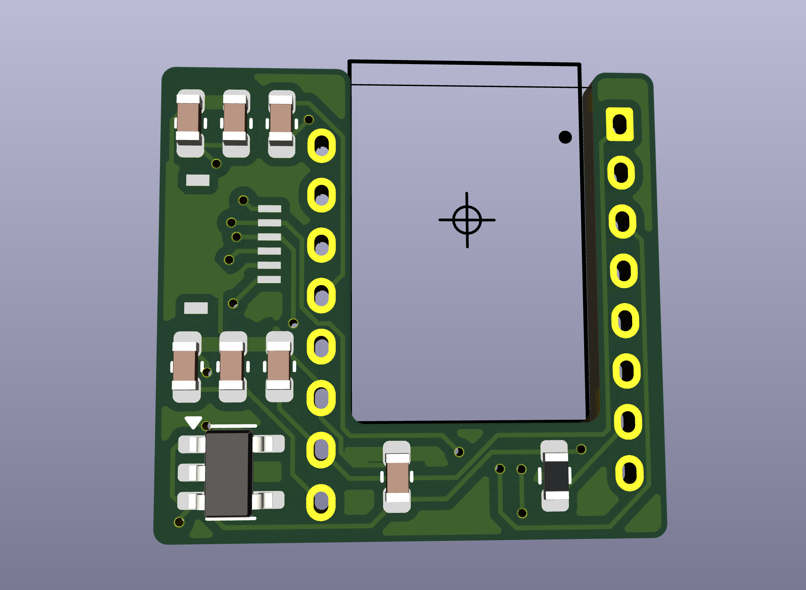

## PMW3610 breakout board (v3)

I've not assembled this design yet. Functionality is not confirmed yet!

動作未確認

Features

- width = 17.6mm
- height = 16.6mm
- Designed for 100% 1-layer PCB assembly
- 3.6V support by default
- 1.8V support by removing LDO
- 6pin 5mm pitch FFC
- Test pad

